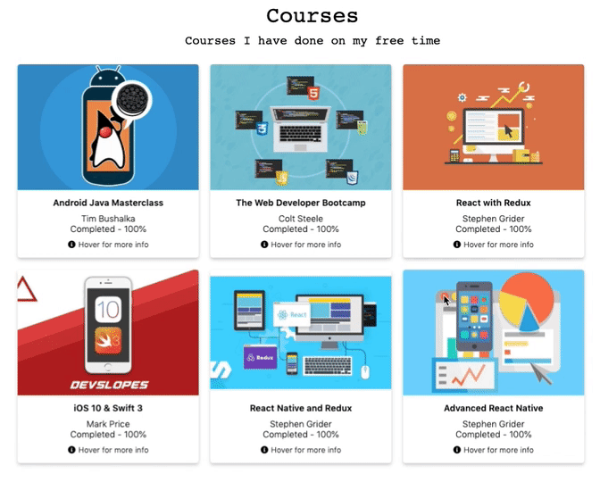

# Install

Use in bash CLI:

`$ npm install --save react-png-flipcard`

# Showcase

[](https://codesandbox.io/s/mw23o99wx?fontsize=14)

[Example on CodeSandbox](https://mw23o99wx.codesandbox.io/)

[Website use Example](jorgebaralt.com)



# React Plug-N'-Go Flipcard

> Renders a card that provides animation to transition between its front and back JSX. The animation is activated on Hover.

[](https://www.npmjs.com/package/react-png-flipcard) [](https://standardjs.com)

## Instructions

1. literally, just plug and go.
2. import FlipCard from "react-png-flipcard";
3. declare the component and pass the required props (front, back, direction, height, width) look below for more details.
4. style front and back as you wish using the frontClass and backClass props.

## Features

1. Nice animation transition between front and back of the card.

## Props

| Props            | Functionality                                                                                           | Default               | Data Type   |
| ---------------- | ------------------------------------------------------------------------------------------------------- | --------------------- | ----------- |
| `front`          | this props receive JSX to be rendered on the front of the card. Look down for examples on how to do it. | <div>Front here</div> | JSX         |
| `back`           | this props receive JSX to be rendered on the back of the card. Look down for examples on how to do it.  | <div>back here</div>  | JSX         |
| `width`          | Width of the card                                                                                       | 300                   | number      |
| `height`         | height of the card                                                                                      | 300                   | number      |
| `direction`      | flip direction                                                                                          | "horizontal"          | string      |
| `flipSpeed`      | Speef of flip animation, in ms                                                                          | 600ms                 | number (ms) |
| `style`          | style object to customize the card                                                                      | NA                    | object      |
| `containerClass` | CSS class to style the card                                                                             | NA                    | css class   |
| `manual`         | Boolean that set animation to be on action (for example on click) this is good to be managed by a state | NA                    | boolean     |
| `flip`           | Boolean state that keeps track of wether card is flipped or not                                         | False                 | boolean     |
| `frontStyle`     | style object to customize the front of the card                                                         | NA                    | object      |
| `backStyle`      | style object to customize the back of the card                                                          | NA                    | object      |
| `frontClass`     | CSS class to style the front of the card                                                                | NA                    | css class   |
| `backClass`      | CSS class to style the back of the card                                                                 | NA                    | css class   |
| `margin`         | Number to set margin                                                                                    | NA                    | number      |

## Usage

### For React.js version ^16.8

#### Uses React Hooks

```jsx
import FlipCard from 'react-png-flipcard';
```

### For React.js version ^15.0.0

#### Uses React Classes to handle state

Pending...

### Example

```jsx
<FlipCard
  front={
    <div className="CardContent">
      
      <h3>Miami</h3>
      <div className="HoverInfo" onClick={() => setFlip(true)}>
        <p style={{ margin: 5 }}>Click here to learn more</p>
        <i className="fas fa-arrow-right" style={{ marginTop: 7 }} />
      </div>
    </div>
  }
  back={
    <div className="CardContent">
      <ul style={{ margin: 15, marginLeft: 5 }}>
        <li>Miami, officially the City of Miami</li>
        <li>
          is the cultural, economic and financial center of South Florida.
        </li>
        <li>
          Miami is the seat of Miami-Dade County, the most populous county in
          Florida.
        </li>
      </ul>
      <div
        className="HoverInfo"
        onClick={() => setFlip(false)}
        style={{ marginLeft: 15 }}
      >
        <p style={{ margin: 5 }}>Go back</p>
        <i className="fas fa-arrow-left" style={{ marginTop: 7 }} />
      </div>
    </div>
  }
  backClass={backClass}
  frontClass={frontClass}
  margin={20}
  width={300}
  height={300}
  borderRadius={50}
  direction="horizontal"
  manual
  flip={flip}
/>
```

## Pending

- Support for react older versions

## License

MIT © [jorgebaralt](https://github.com/jorgebaralt)
